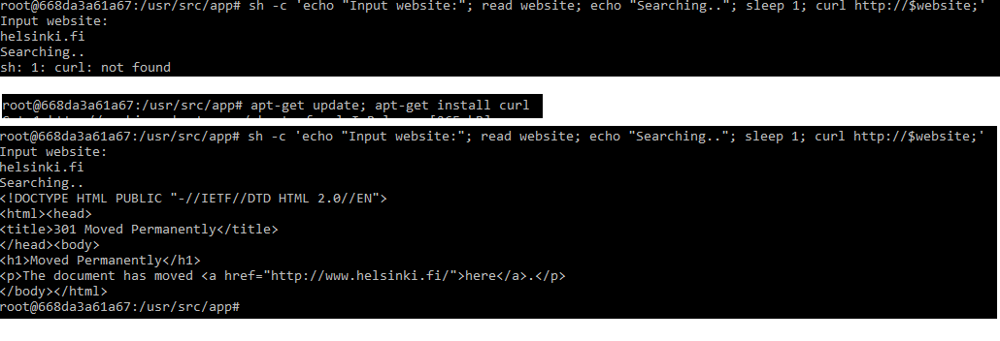
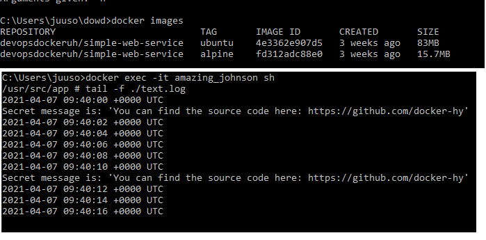
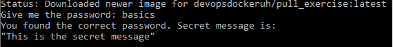

### 1.1

### 1.2

### 1.3

### 1.4

### 1.5

### 1.6

### 1.7

[HERE](./1.7)

### 1.8

[HERE](./1.8)

### 1.9

### 1.10

### 1.11

[HERE](./1.11)

### 1.12

[HERE](./1.12)

### 1.13

[HERE](./1.13)

### 1.14

[Front-end Dockerfile](./1.12/Dockerfile)
[Back-end Dockerfile](./1.13/Dockerfile)

Front-end command: `docker run -p 3000:5000 front`
Back-end command: `docker run -p 3001:8000 back`

### 1.15

skipped

### 1.16

[HERE](https://doheharkka.herokuapp.com/)

